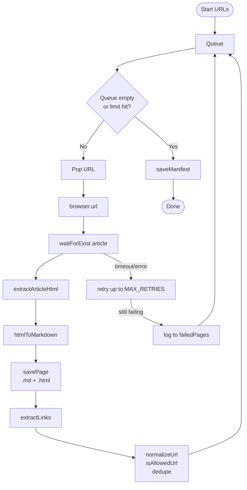
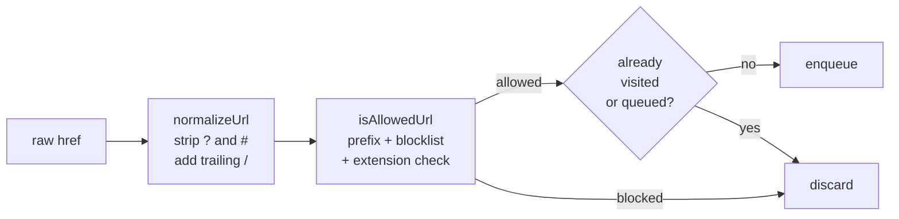

# WDIO Docs Crawler

A WebdriverIO-powered crawler that visits the WebdriverIO documentation site and extracts main article content to clean markdown files for RAG pipelines.

## What it produces

```
docs_dataset/
  markdown/          # one .md file per page with YAML frontmatter
  raw_html/          # raw article HTML for debugging
  manifest.json      # index of every crawled and failed page
```

Markdown file format:

```md
---
title: "Configuration"
source_url: "https://webdriver.io/docs/configuration/"
crawled_at: "2026-05-17T12:00:00.000Z"
crawler: "wdio"
---

# Configuration
...
```

The generated `manifest.json` tracks every URL attempted, its output files and any errors.

## How it works

`crawl.e2e.ts` is the only file that touches the browser. Every other module is for function or does file I/O.

### High-level flow



### URL pipeline

Every href discovered on a page passes through three pure functions before entering the queue:



### Content extraction

`extractArticleHtml` tries a compound CSS selector and waits for the first match before calling `getHTML()`: `article, main article, .theme-doc-markdown, .markdown`

Turndown converts the HTML to markdown. A list of selectors (`nav`, `footer`, `aside`, `.sidebar`, etc.) are stripped before conversion so navigation chrome never ends up in the output.

### Retry and error handling

Each page gets up to `MAX_RETRIES` (2) attempts with a 1-second pause between them. If all attempts fail the URL is recorded in `failed_pages` in the manifest and the crawl continues. The crawl only fails hard if the browser cannot start or the output directory cannot be written.

---

## URL scope

**Allowed:**
```
https://webdriver.io/docs/**
```

**Blocked** (even if under `/docs/`):
- `/blog/`, `/community/`, `/sponsor/`, `/versions/`, `/search/`
- Versioned paths: `/docs/v7/`, `/docs/v8/`, `/docs/5.0/`, etc.
- File extensions: images, CSS, JS, fonts, PDF

**Slug examples:**

| URL | Slug | File |
|-----|------|------|
| `https://webdriver.io/docs/` | `index` | `index.md` |
| `https://webdriver.io/docs/configuration/` | `configuration` | `configuration.md` |
| `https://webdriver.io/docs/api/browser/url/` | `api-browser-url` | `api-browser-url.md` |
| `https://webdriver.io/docs/api/element/click/` | `api-element-click` | `api-element-click.md` |

## Limits

| Constant | Default | Purpose |
|----------|---------|---------|
| `MAX_PAGES` | 80 | Hard cap — prevents runaway crawls |
| `REQUEST_DELAY_MS` | 500 | Pause between pages |
| `MAX_RETRIES` | 2 | Attempts per page before recording as failed |
| `PAGE_TIMEOUT_MS` | 15000 | `waitForExist` timeout on article element |

## Running

### Prerequisites

- Node.js 18+
- Google Chrome

### Install

```bash
cd crawler
npm install
```

### Run the crawler

```bash
npm run crawl:wdio
```

Expected output:

```
Starting WDIO docs crawl
Start URLs: 2
Max pages: 80

[1/80] Crawling https://webdriver.io/docs/
Saved markdown: index.md
Discovered links: 24

[2/80] Crawling https://webdriver.io/docs/configuration/
Saved markdown: configuration.md
Discovered links: 18

...

Crawl complete
Pages saved: 42
Failed pages: 0
Output: docs_dataset/markdown
Manifest: docs_dataset/manifest.json
```

### Re-running

The crawler overwrites existing output files. Delete `docs_dataset/` before a fresh crawl or leave it, as either is safe.

### Run unit tests

```bash
cd crawler
npm test
```

The unit tests cover the four pure functions (`normalizeUrl`, `isAllowedUrl`, `slugFromUrl`, `cleanMarkdown`) and run without a browser.

## Debugging a failed page

1. Check `docs_dataset/manifest.json` for `failed_pages` for the error message.
2. The raw HTML for successfully crawled pages is in `docs_dataset/raw_html/` to compare against the markdown to diagnose extraction issues.
3. To test a single URL manually, temporarily set `START_URLS` to just that URL and `MAX_PAGES` to 1 in `src/config.ts`.
