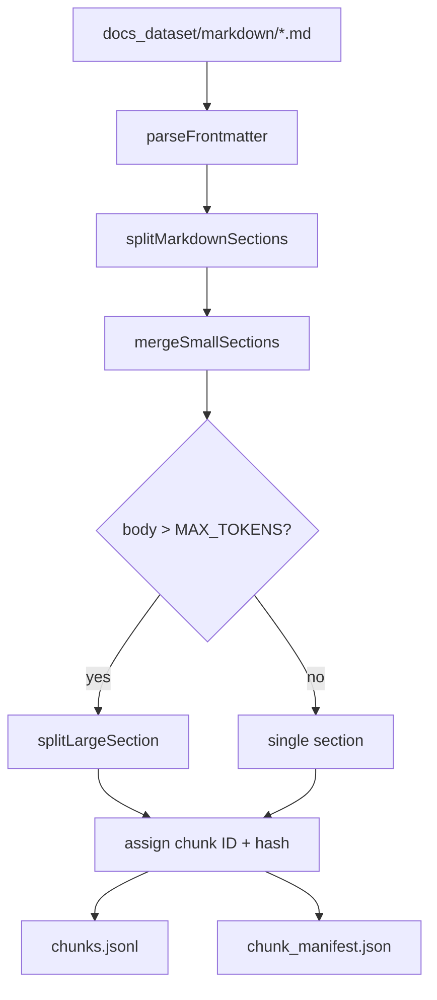
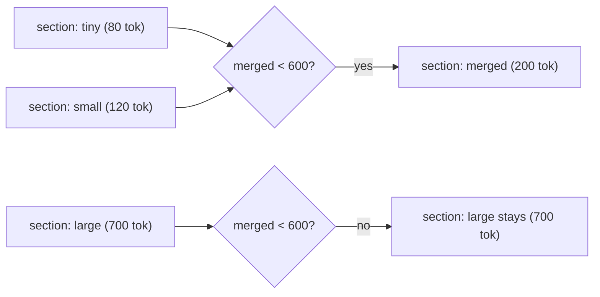
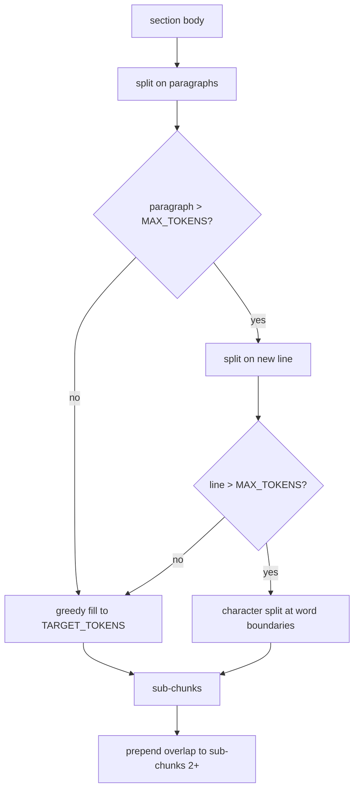
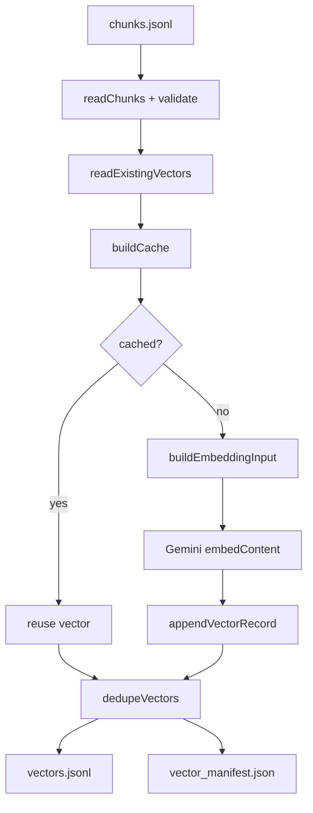
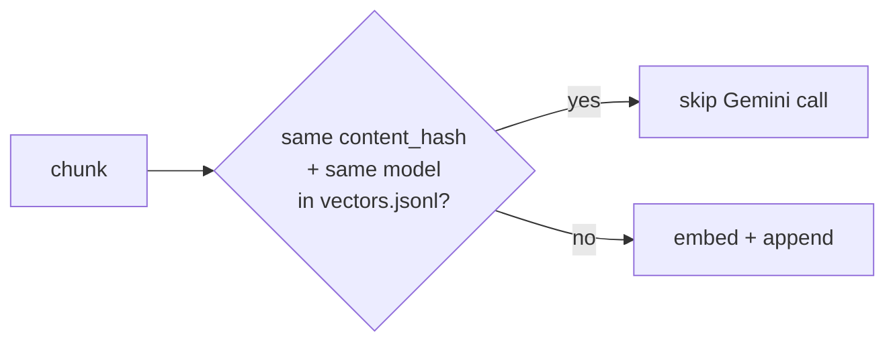

# Ingestion

Two-stage pipeline that converts crawled WebdriverIO docs into Gemini embedding vectors for RAG retrieval.

**Stage 1 (Chunker)**: splits markdown docs into token-bounded sections.

**Stage 2 (Embedder)**: uses Gemini to embed each chunk.

## What it produces

| File | Description |
|---|---|
| `docs_dataset/chunks/chunks.jsonl` | JSONL file containing the chunks |
| `docs_dataset/chunks/chunk_manifest.json` | Chunker run stats |
| `docs_dataset/vectors/vectors.jsonl` | JSONL file containing the vector records |
| `docs_dataset/vectors/vector_manifest.json` | Embedder run stats |

My current chunker output: **2,333 chunks** from **348 docs**, avg **380 tokens/chunk**, max **1,063 tokens**.

## How to run

Run the crawler first, this requires `docs_dataset/markdown/`.

```bash
# Install dependencies
npm install

# Stage 1: chunk the markdown docs
npm run chunk:docs

# Stage 2: embed the chunks (update the GEMINI_API_KEY)
GEMINI_API_KEY=your_key npm run embed:docs

# Tests
npm test
```

## Pipeline



### Stage 1: Parse frontmatter

`parseFrontmatter` uses [gray-matter](https://github.com/jonschlinkert/gray-matter) to strip the YAML block written by the crawler to expose `title`, `source_url`, `crawled_at` and the markdown body.

### Stage 2: Split by headings

`splitMarkdownSections` walks the markdown line by line and cuts a new section on every H1/H2/H3 heading. exceptions:

- **Code fence tracking**: toggles `inCodeBlock` on ` ``` ` or `~~~` so heading-like lines inside code blocks are not split.
- **Docusaurus anchor stripping**: Docusaurus appends a zero-width space (U+200B) link `[​](#anchor)` to heading text. These are stripped before the heading is recorded.

Each section carries a `headingPath` that saves its ancestry:

```
## Browser | ### getGeoLocation
```

### Stage 3: Merge small sections

Sections under `MIN_TOKENS` (150) are merged forward into the next section as long as the combined body stays under `TARGET_TOKENS` (600). The first section's `headingPath` is kept to prevent a single-sentence H3 subsection from becoming its own isolated chunk.



### Stage 4: Split large sections

Sections over `MAX_TOKENS` (1,000) go through a three-tier split:



**\[ Tier 1 ] paragraph** (`\n\n`): greedy fill up to TARGET_TOKENS then flush when full.

**\[ Tier 2 ] line** (`\n`): for any paragraph that exceeds MAX_TOKENS on its own like dense code blocks or long tables are split by individual lines instead.

**\[ Tier 3 ] character**: for single-line blobs where Turndown has collapsed a `<pre>` block into one long space-delimited string, split at word boundaries in TARGET_TOKENS×4 character chunks.

**Overlap**: each sub-chunk after the first gets up to `OVERLAP_TOKENS` (100) of trailing text from the previous sub-chunk. Paragraphs that individually exceed OVERLAP_TOKENS are skipped to prevent overflow.

### Stage 5: IDs and hashes

```
chunk_id = {doc_id}-{slugified_heading_path}-{padded_index}

e.g. api-browser-geolocation-getgeolocation-0003
```

- `doc_id`: URL path with `/` replaced by `-`, e.g. `api-browser-geolocation`
- `slugified_heading_path`: slugified `-` lowercased, non-alphanumeric stripped, spaces collapsed to `-`
- `padded_index`: 4-digit zero-padded, resets per document

`content_hash` is SHA-256 of the core body **before** overlap is prepended, so the hash is stable across chunking runs and can drive embedding cache invalidation.

## Chunk schema

```typescript
interface Chunk {
  chunk_id:     string   // "api-browser-geolocation-getgeolocation-0003"
  doc_id:       string   // "api-browser-geolocation"
  title:        string   // page title from frontmatter
  url:          string   // canonical URL
  heading_path: string   // "## Browser | ### getGeoLocation"
  content:      string   // chunk body (may include overlap prefix)
  token_count:  number   // Math.ceil(content.length / 4)
  content_hash: string   // SHA-256 hex of core body (no overlap)
  crawled_at:   string   // ISO timestamp from crawler
  chunk_index:  number   // 0-based within doc
}
```

## Token constants

| Constant | Value | Role |
|---|---|---|
| `MIN_TOKENS` | 150 | Sections below this are merged forward |
| `TARGET_TOKENS` | 600 | Greedy fill target for paragraph grouping |
| `MAX_TOKENS` | 1000 | Hard ceiling; triggers splitting above this |
| `OVERLAP_TOKENS` | 100 | Max overlap prepended to continuation sub-chunks |

---

## Stage 2: Embedder

Reads `chunks.jsonl`, calls the Gemini embedding API and writes `vectors.jsonl`. Safe to interrupt and resume as already embedded chunks are skipped on rerun.

### Pipeline



### Embedding input format

Raw chunk content is not sent directly. Each request is prefixed with structured context so the model understands what the text is about:

```
Title: Configuration File | WebdriverIO
Section: Configuration File > Example Configuration
Source: https://webdriver.io/docs/configurationfile/

The configuration file contains all necessary information...
```

`buildEmbeddingInput` strips the `#` prefix from `heading_path` segments and converts the ` | ` separator to ` > `.

### Resume and caching

Cache key: `content_hash::embedding_model`



On rerun, every chunk whose `content_hash` already exists in `vectors.jsonl` for the same model is skipped. If a chunk's content changes between crawler runs, its hash changes and it is re-embedded automatically.

### Rate limit handling

| Setting | Value |
|---|---|
| `REQUEST_DELAY_MS` | 500ms between requests |
| `MAX_RETRIES` | 3 |
| Backoff schedule | 5s → 15s → 30s |

On a permanent failure after all retries, progress is saved and the process exits cleanly:

```
Rate limit hit for configuration-capabilities-0001
Retrying in 5s... (attempt 1/3)
Retrying in 15s... (attempt 2/3)
Retrying in 30s... (attempt 3/3)
Failed after 3 retries: configuration-capabilities-0001
Progress saved. Rerun npm run embed:docs to continue.
```

### Deduplication

Because vectors are appended incrementally, a rerun after partial failure will produce duplicate lines for any chunk that was embedded in a previous run and again in the new run. After all chunks are processed, `dedupeVectors` rewrites the file keeping the last record per `chunk_id + content_hash + embedding_model`.

### Vector record schema

```typescript
interface VectorRecord {
  chunk_id:        string    // "api-browser-geolocation-getgeolocation-0003"
  doc_id:          string    // "api-browser-geolocation"
  title:           string    // page title
  url:             string    // canonical URL
  heading_path:    string    // "## Browser | ### getGeoLocation"
  content:         string    // chunk body
  token_count:     number
  content_hash:    string    // SHA-256 hex
  crawled_at:      string    // ISO timestamp
  chunk_index:     number    // 0-based within doc
  embedding_model: string    // "gemini-embedding-001"
  embedding:       number[]  // 3072-dimensional vector
  metadata:        { source: 'webdriverio' }
}
```

### Embedding constants

| Constant | Value |
|---|---|
| `EMBEDDING_MODEL` | `gemini-embedding-001` |
| `REQUEST_DELAY_MS` | 500 |
| `MAX_RETRIES` | 3 |
| `BACKOFF_MS` | [5000, 15000, 30000] |
