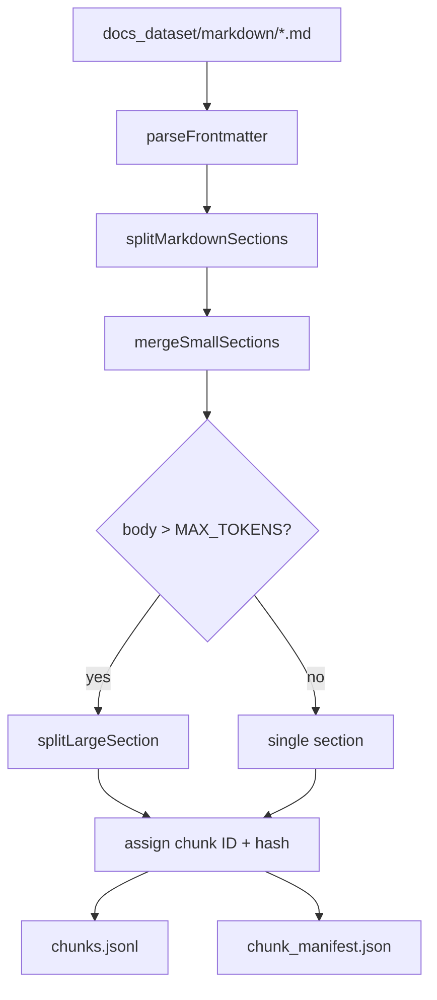
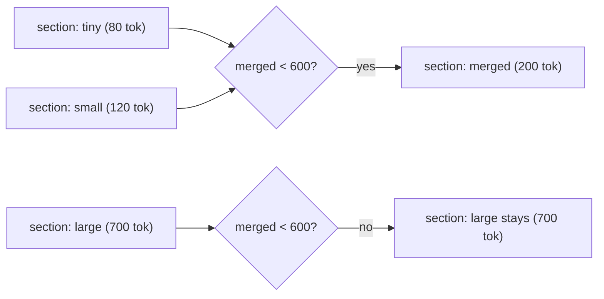
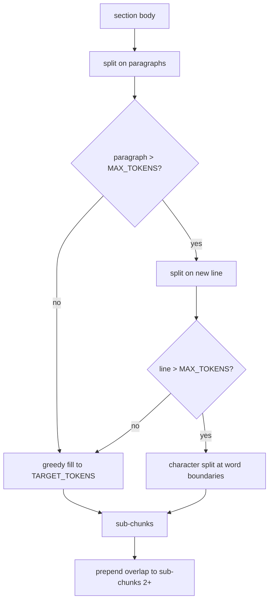

# Ingestion

Reads the crawled WebdriverIO docs from `docs_dataset/markdown/` and produces token-bounded chunks ready for embedding.

## What it produces

| File | Description |
|---|---|
| `docs_dataset/chunks/chunks.jsonl` | One JSON object per line, each a chunk |
| `docs_dataset/chunks/chunk_manifest.json` | Run stats: total chunks, docs, token distribution |

My current run is: **2,333 chunks** from **348 docs**, avg **380 tokens/chunk**, max **1,063 tokens**.

## How to run

Run the crawler first as it tequires `docs_dataset/markdown/`

```bash
# Install dependencies 
npm install

# To run
npm run chunk:docs

# To tests
npm test
```

## Pipeline



### Stage 1: Parse frontmatter

`parseFrontmatter` uses [gray-matter](https://github.com/jonschlinkert/gray-matter) to strip the YAML block written by the crawler to expose `title`, `source_url`, `crawled_at` and the markdown body.

### Stage 2: Split by headings

`splitMarkdownSections` walks the markdown line by line and cuts a new section on every H1/H2/H3 heading. exceptions:

- **Code fence tracking**: toggles `inCodeBlock` on ` ``` ` or `~~~` so heading-like lines inside code blocks are not split.
- **Docusaurus anchor stripping**: Docusaurus appends a zero-width space (U+200B) link `[​](#anchor)` to heading text. These are stripped before the heading is recorded.

Each section carries a `headingPath` that saves its ancestry:

```
## Browser | ### getGeoLocation
```

### Stage 3: Merge small sections

Sections under `MIN_TOKENS` (150) are merged forward into the next section as long as the combined body stays under `TARGET_TOKENS` (600). The first section's `headingPath` is kept to prevent a single-sentence H3 subsection from becoming its own isolated chunk.



### Stage 4: Split large sections

Sections over `MAX_TOKENS` (1,000) go through a three-tier split:



**\[ Tier 1 ] paragraph** (`\n\n`): greedy fill up to TARGET_TOKENS then flush when full.

**\[ Tier 2 ] line** (`\n`): for any paragraph that exceeds MAX_TOKENS on its own like dense code blocks or long tables are split by individual lines instead.

**\[ Tier 3 ] character**: for single-line blobs where Turndown has collapsed a `<pre>` block into one long space-delimited string, split at word boundaries in TARGET_TOKENS×4 character chunks.

**Overlap**: each sub-chunk after the first gets up to `OVERLAP_TOKENS` (100) of trailing text from the previous sub-chunk. Paragraphs that individually exceed OVERLAP_TOKENS are skipped to prevent overflow.

### Stage 5 — IDs and hashes

```
chunk_id = {doc_id}-{slugified_heading_path}-{padded_index}

e.g. api-browser-geolocation-getgeolocation-0003
```

- `doc_id`: URL path with `/` replaced by `-`, e.g. `api-browser-geolocation`
- `slugified_heading_path`: slugified `-` lowercased, non-alphanumeric stripped, spaces collapsed to `-`
- `padded_index`: 4-digit zero-padded, resets per document

`content_hash` is SHA-256 of the core body **before** overlap is prepended, so the hash is stable across chunking runs and can drive embedding cache invalidation.

## Chunk schema

```typescript
interface Chunk {
  chunk_id:     string   // "api-browser-geolocation-getgeolocation-0003"
  doc_id:       string   // "api-browser-geolocation"
  title:        string   // page title from frontmatter
  url:          string   // canonical URL
  heading_path: string   // "## Browser | ### getGeoLocation"
  content:      string   // chunk body (may include overlap prefix)
  token_count:  number   // Math.ceil(content.length / 4)
  content_hash: string   // SHA-256 hex of core body (no overlap)
  crawled_at:   string   // ISO timestamp from crawler
  chunk_index:  number   // 0-based within doc
}
```

## Token constants

| Constant | Value | Role |
|---|---|---|
| `MIN_TOKENS` | 150 | Sections below this are merged forward |
| `TARGET_TOKENS` | 600 | Greedy fill target for paragraph grouping |
| `MAX_TOKENS` | 1000 | Hard ceiling; triggers splitting above this |
| `OVERLAP_TOKENS` | 100 | Max overlap prepended to continuation sub-chunks |

